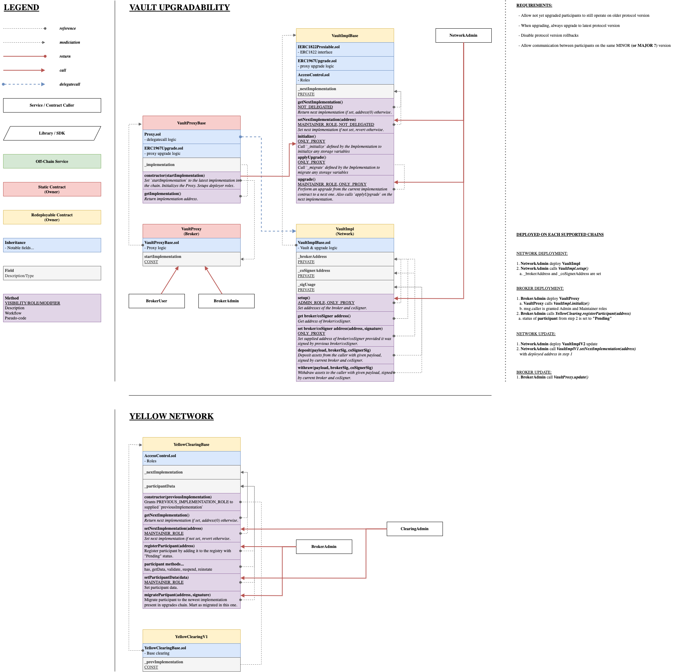

<!-- DOCTOC SKIP -->

# Architecture

## Vesting

`Vesting` contract is responsible for guaranteeing that all the investors will get specific amound of tokens in specific amount of time.

TODO: full description.

## Yellow Network

